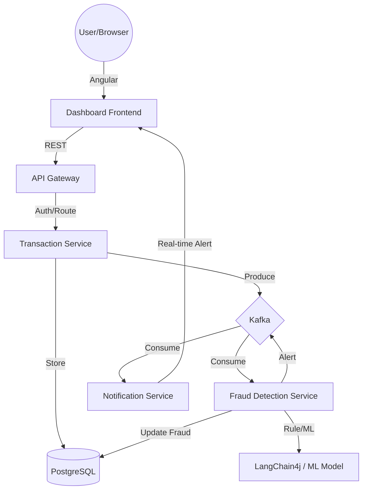

# Phase 1: Architecture and Project Setup

This phase focuses on establishing the core architecture, microservices layout, and the shared environment configuration for the Real-time Transaction Monitoring and Fraud Detection System.

## Architectural Overview

The system follows a **Microservices Architecture** using **Clean Architecture** principles within each service. It leverages **Event-Driven Communication** via Apache Kafka for real-time processing.

### Key Components

1.  **API Gateway (Quarkus):** The single entry point. Handles JWT-based authentication and routes requests to downstream services.
2.  **Transaction Service (Quarkus):** Manages transaction ingestion. Stores transaction details in PostgreSQL and publishes "Transaction Created" events to Kafka.
3.  **Fraud Detection Service (Quarkus):** The "brain" of the system.
    *   Consumes transaction events from Kafka.
    *   Applies rule-based logic (e.g., amount limits, frequency).
    *   Uses a basic ML model/logic for anomaly detection.
    *   Integrates **LangChain4j** to generate AI explanations for flagged transactions.
    *   Updates the transaction status/score in PostgreSQL.
4.  **Notification Service (Quarkus):** Consumes fraud alerts and handles real-time notifications (via WebSockets or simulated alerts).
5.  **Dashboard Frontend (Angular):** A modern, real-time dashboard to visualize transactions, risk scores, and AI explanations.
6.  **Infrastructure:** Managed via Docker Compose (PostgreSQL, Kafka, Zookeeper).

### Data Flow



## Proposed Folder Structure

We will use a mono-repo approach for development convenience, which is common for smaller microservice projects.

```text
/transaction-monitoring-system
├── api-gateway/               # Quarkus Gateway
├── transaction-service/        # Quarkus Transaction Logic
├── fraud-detection-service/    # Quarkus Fraud & AI Logic
├── notification-service/       # Quarkus Notifications
├── dashboard-frontend/         # Angular App
├── infrastructure/            # Common configs (SQL scripts, etc.)
├── docker-compose.yml          # Orchestration
└── .env                       # Environment secrets
```

## Phase 1 Tasks

### 1. Root Directory Setup
- Initialize the root directory and create the `.env` file for global secrets (DB credentials, Kafka brokers, OpenAI API Key).

### 2. Infrastructure Definition
- Create the initial `docker-compose.yml` defining:
    - **PostgreSQL**: Single instance shared (with separate schemas/databases for services).
    - **Kafka & Zookeeper**: For event streaming.

### 3. Service Scaffolding (Quarkus)
- I will prepare the commands to scaffold 4 Quarkus services using `quarkus-maven-plugin`.
- Each service will include:
    - `quarkus-resteasy-reactive` (REST APIs)
    - `quarkus-smallrye-reactive-messaging-kafka` (Kafka integration)
    - `quarkus-hibernate-orm-panache` & `quarkus-jdbc-postgresql` (Database)
    - `quarkus-smallrye-jwt` (Security for Gateway/Services)

### 4. Shared Domain/DTO Strategy
- Define the common Transaction event schema that will be shared across services.

## User Review Required

> [!IMPORTANT]
> **AI Provider:** Please confirm if you have an OpenAI API key or if you'd prefer to use a local LLM via Ollama or a different provider (e.g., Anthropic, Gemini) for LangChain4j.

> [!NOTE]
> **Database:** Do you prefer separate PostgreSQL instances for each service (strict microservices) or a single shared instance with different databases? I'll proceed with a single shared instance for simplicity unless specified.

## Next Steps

Once this architecture is approved, we will proceed to **Phase 2: Backend Microservices (Quarkus)** where we will build the API Gateway and Transaction Service.
