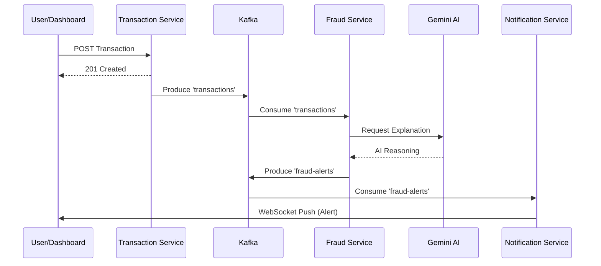

# Project Walkthrough: Real-time AI Fraud Detection

We have successfully built a production-ready system that monitors transactions in real-time, scores them for fraud, and uses Google Gemini to explain the reasoning.

## 1. System Components
- **API Gateway**: Entry point for all requests.
- **Transaction Service**: Handles POST/GET of transactions.
- **Fraud Detection Service**: Uses rules + ML + LangChain4j (Gemini).
- **Notification Service**: Broadcasts alerts via WebSockets.
- **Angular Dashboard**: The real-time user interface.

## 2. Real-time Flow

## 3. How to Run
1. Update `.env` with your `GEMINI_API_KEY`.
2. Run `docker-compose up --build`.
3. Open `http://localhost:4200` to see the dashboard.

## 4. Key Learning Resources
- [Phase 1: Architecture](file:///d:/career/transaction%20processinf%20and%20fraud%20detection/phase_1_learning_guide.md)
- [Phase 2: Backend & Security](file:///d:/career/transaction%20processinf%20and%20fraud%20detection/phase_2_learning_guide.md)
- [Phase 3: Fraud Logic](file:///d:/career/transaction%20processinf%20and%20fraud%20detection/phase_3_learning_guide.md)
- [Phase 4: AI & LangChain4j](file:///d:/career/transaction%20processinf%20and%20fraud%20detection/phase_4_learning_guide.md)
- [Phase 5: WebSockets](file:///d:/career/transaction%20processinf%20and%20fraud%20detection/phase_5_learning_guide.md)
- [Phase 6: Angular Frontend](file:///d:/career/transaction%20processinf%20and%20fraud%20detection/phase_6_learning_guide.md)
- [Phase 7: Dockerization](file:///d:/career/transaction%20processinf%20and%20fraud%20detection/phase_7_learning_guide.md)
- [Final Deployment Guide](file:///d:/career/transaction%20processinf%20and%20fraud%20detection/deployment_guide.md)
